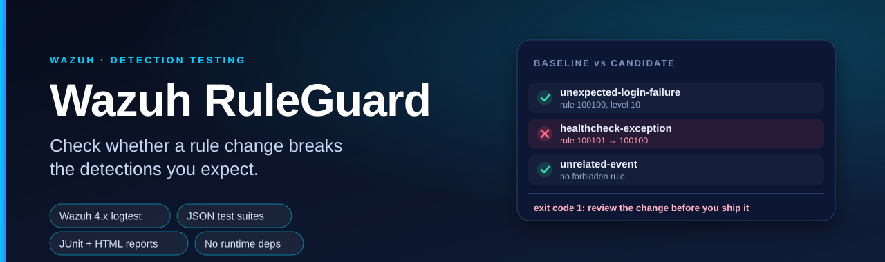
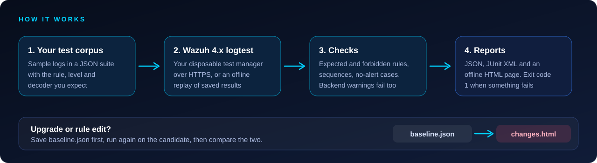
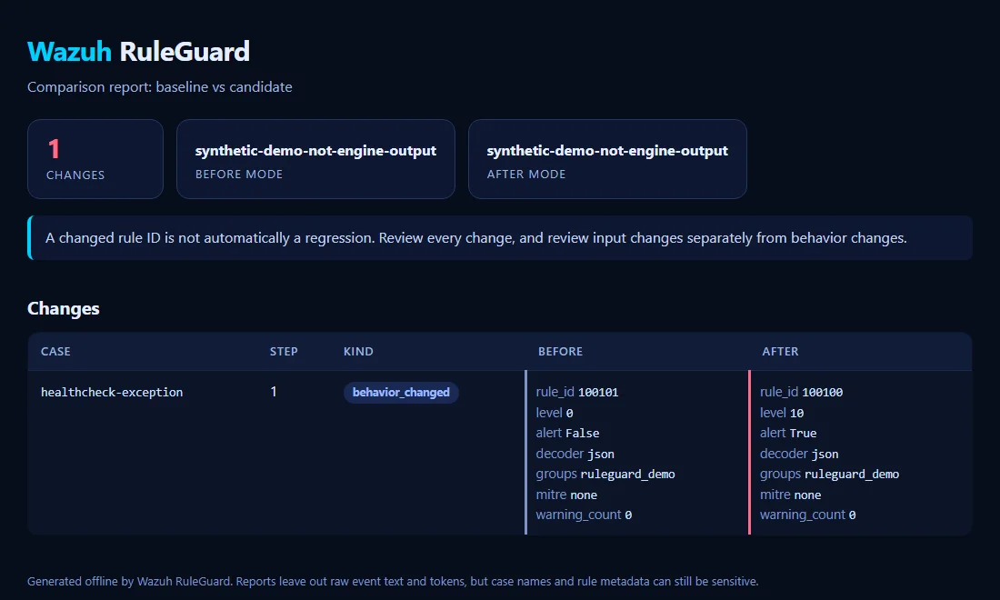

<h1 align="center"></h1>

<p align="center">
  <a href="https://github.com/farhan6667/wazuh-ruleguard/actions/workflows/ci.yml"></a>
  <a href="LICENSE"></a>
  
  
  
</p>

**Wazuh RuleGuard is an open source command line tool for Python 3.10+ that tests Wazuh 4.x detection rules against a JSON suite of sample logs and tells you which detections changed after a rule edit or a manager upgrade.** Independent project by Syed Farhan Ahmed (SFA) at NexaForge. It is not affiliated with, sponsored by or endorsed by Wazuh Inc.


Check whether a Wazuh rule change breaks the detections you expect.

RuleGuard sends your sample logs to the Wazuh 4.x logtest API and checks the
results against a JSON suite. Run the same suite before and after a change to see
which detections moved. Reports work in a terminal, CI job or browser.

Requires Python 3.10 or newer. There are no runtime dependencies.

Version 0.2.0 is a prototype. Local tests cover the client and CLI on Windows with
Python 3.12. Live Wazuh validation is still pending, and the demo observations are
synthetic. This adapter supports the 4.x API contract; Wazuh 5.x needs a different
adapter.

## At a glance

| | |
|---|---|
| **Tests** | Wazuh 4.x detection changes against a JSON suite of sample logs |
| **Checks** | Rule ID, alert flag, level, decoder, ATT&CK IDs, groups, forbidden rules, sequences |
| **Reports** | JSON, JUnit XML, a readable offline HTML page and a Markdown summary for CI, plus a baseline vs candidate comparison |
| **Start fast** | `ruleguard init` writes a starter suite, and a JSON Schema gives you editor checks and autocomplete |
| **Runs on** | Python 3.10+, no runtime dependencies, offline replay mode for the demo |
| **Status** | Prototype. Live Wazuh validation is still pending |

## Why keep a test corpus?

Suppose you add an exception for a healthcheck account. The healthcheck should
stop alerting, but an ordinary failed login should still trigger its rule. Keep
both samples in a suite so the next rule edit tests both outcomes.

A manager upgrade can also change decoding or rule selection. Saving a baseline
lets you review those changes for the samples in your corpus.

## Checks and reports

Each event can check the rule ID, alert flag, level and decoder. You can also
require ATT&CK IDs or rule groups, forbid particular rules, or expect no alert.
Events within one case share a logtest session for correlation. Each case gets
its own session, and an unexpected session replacement fails the run.

Backend warnings fail checks by default, including warnings about configuration
or list loading. JSON, JUnit XML and offline HTML reports give you a result to
review. The comparison records changed inputs separately from changed behavior.
It omits timestamps, counters, descriptions, JWTs and raw event text.

HTTPS certificates are verified. Custom CA files are supported, redirects are
blocked and requests aren't retried automatically.

## How it works

<p align="center"></p>

## Try the offline demo

From the repository directory, no install is required:

```sh
python -m ruleguard validate examples/suite.json
python -m ruleguard run examples/suite.json --replay examples/synthetic-before.json --json result.json --junit result.xml --html result.html
python -m ruleguard compare examples/synthetic-before.json examples/synthetic-after.json --json diff.json --html diff.html
```

The run should pass three checks in **offline-replay** mode. The compare command should exit
1 and identify the deliberately broken healthcheck exception. Replay checks stored observations;
it does not evaluate detection rules or establish current engine behavior.

Install the CLI with `python -m pip install .`, then use `ruleguard` instead of
`python -m ruleguard`.

## What a report looks like

The HTML report is one offline page with no scripts and no remote assets. This is the comparison from the demo above: the healthcheck exception stopped suppressing its alert.

<p align="center"></p>

Add `--markdown summary.md` to `run` or `compare` to get the same result as a table you can append to `$GITHUB_STEP_SUMMARY`. The [CI guide](docs/ci.md) has copy-ready workflows.

## Start a suite in a minute

```sh
ruleguard init suite.json     # writes two sample cases and refuses to overwrite a file
ruleguard validate suite.json # checks the structure before it touches a manager
ruleguard schema > suite.schema.json
```

The starter file points at the project's JSON Schema, so editors such as VS Code can flag a typo in an expectation key as you type. `ruleguard schema` prints the same schema for offline use.

## Use it with Wazuh NoiseLens

The two tools cover both halves of tuning. [Wazuh NoiseLens](https://github.com/farhan6667/wazuh-noiselens) answers "what would this exception hide in my last month of alerts?". Once you have written the exception, RuleGuard answers "do the detections I care about still fire, and does the healthcheck stay quiet?". Keep one sample of each kind in your suite and run both before you change the manager.

## Run it in a container

Each release publishes an image to GitHub Packages, so you can run RuleGuard without installing Python:

```sh
docker run --rm --user "$(id -u):$(id -g)" -v "$PWD:/work" ghcr.io/farhan6667/wazuh-ruleguard   run examples/suite.json --replay examples/synthetic-before.json --json result.json
```

The image runs as a non-root user and contains only RuleGuard. Mount the folder with your suite, and pass the manager token as an environment variable (`-e WAZUH_API_TOKEN`) when you test against a real manager.

## Connect a test manager

Set `WAZUH_API_TOKEN` to an existing, temporary Wazuh API JWT using your normal secret
management process. Never put it in the suite or command arguments. Then:

```sh
ruleguard run examples/suite.json --api https://test-manager.example:55000 --ca-file manager-ca.pem --json candidate.json --junit candidate.xml
```

Load your own rules and decoders on the disposable manager first. RuleGuard does not install
rules, restart services, change production settings, or authenticate with username/password.
For the teaching example, `examples/local_rules.xml` contains custom rule IDs that must be
checked for collisions before use. Its expected output still needs live verification.

Use a account with only the required permissions authorized for logtest and session cleanup. The existing JWT is
used only on the specified HTTPS origin; environment proxies are ignored. No insecure TLS
switch is provided. Long suites may require a JWT lifetime that covers the run; a failed request
is not retried because a retry could duplicate correlation events.

## Suite contract

```json
{
  "schema_version": 1,
  "cases": [{
    "id": "application-login-failure",
    "events": [{
      "event": "{\"event_type\":\"login_failure\",\"username\":\"demo_user\"}",
      "location": "ruleguard",
      "log_format": "syslog",
      "expect": {"rule_id": "100100", "level": 10, "mitre_contains": ["T1110"]}
    }]
  }]
}
```

Every event needs an expectation. Supported keys: `rule_id` (string or null), `decoder`
(string or null), `level`, `alert`, `forbidden_rule_ids`, `groups_contains`, `mitre_contains`.
Lists are containment checks, not exact ordering checks. Unknown expectation/event keys fail
validation rather than silently skipping a typo. Use several events in a case to test a
sequence; use different cases for independent positive/negative scenarios.

For archived Wazuh records, use the original `full_log` as the event, not the entire alert
wrapper. Preserve its original location when your rules depend on it.

## Upgrade workflow

1. Use the same corpus against your current disposable test manager; save `baseline.json`.
2. Load the same custom rules and dependencies on the candidate manager; save `candidate.json`.
3. `ruleguard compare baseline.json candidate.json --json changes.json --html changes.html`.
4. Review every change; a changed rule ID is not automatically a vulnerability or regression.
5. Follow up with ingestion and alert delivery tests before rolling out an upgrade.

Exit codes: 0 checks pass/no differences, 1 assertions/differences/backend run errors, 2
invalid configuration/input or output failure, 130 interruption. `--allow-warnings` explicitly
permits backend warnings. It should only be used after reviewing the manager locally.

## Limits and data handling

Logtest does not prove production log collection, indexing, alert delivery or live correlation
will work. Sequences run as fast as the API responds; this is not a simulator with a virtual clock and
does not exercise delays, events arriving out of order or production traffic volume. The corpus defines
the coverage; passing a small corpus cannot establish detection quality across your fleet.

Reports exclude raw event text and session/JWT tokens. Case names, rule metadata and fingerprints
can still be sensitive: inspect artifacts before sharing them. Inputs are sent only to the manager
you specify. Outputs cannot overwrite inputs. Cleanup is attempted even on run failure; a process
crash or network outage may leave a session until Wazuh expires it.

## Related tools

[wazuhdevenv](https://github.com/zbalkan/wazuhdevenv) provides an established testing development
environment. [wazuhtester](https://pypi.org/project/wazuhtester/) offers a socket client and pytest
integration. RuleGuard focuses on JSON scenario contracts, HTTPS manager access, explicit
negative cases and reports for comparing runs. Compare the available tools against your workflow before choosing one.

API behavior follows [Wazuh's official logtest documentation](https://documentation.wazuh.com/current/user-manual/ruleset/testing.html).

## Development

```sh
python -m unittest discover -s tests -v
```

Contributions most useful before a release: live manager compatibility results with the version
and sanitized fixtures, negative cases for common exceptions, and real correlation scenarios.
Do not upload organization logs or credentials. See [contribution notes](CONTRIBUTING.md) and [security notes](SECURITY.md).


For a walkthrough with expected exit codes, see [the demo guide](docs/demo.md).

## Contribute

This project is free and built in the open, and I would like it to be shaped by people who run Wazuh every day. The most useful things you can send:

- a **compatibility report** from a real Wazuh 4.x manager (the demos are synthetic, so this is the biggest gap),
- a **synthetic example** that matches a log source you know,
- a fix, a test, or a clearer sentence in the docs.

Start with a [good first issue](https://github.com/farhan6667/wazuh-ruleguard/labels/good%20first%20issue) or say hello in [Discussions](https://github.com/farhan6667/wazuh-ruleguard/discussions). The [contributing guide](CONTRIBUTING.md) explains the two minute setup. It carries the `hacktoberfest` topic, and pull requests are welcome whether or not you take part.

## Frequently asked questions

### How do I test Wazuh rules before deploying them?
Write a JSON suite with sample logs and the rule ID, level or decoder you expect for each one. Run `ruleguard run` against a disposable Wazuh 4.x test manager and it checks every sample through the logtest API. You can also replay saved results offline to learn the format.

### How can I check that a Wazuh upgrade did not change my detections?
Run the same suite on your current test manager and save the result as `baseline.json`. Run it again on the candidate manager, then use `ruleguard compare`. The command exits with 1 and writes a report when a rule ID, alert flag or decoder moved. Review each change, because a different rule ID is not automatically a regression.

### Can I use it in CI?
Yes. It writes JUnit XML and uses exit codes (0 for clean, 1 for failed checks or differences, 2 for invalid input), so a pipeline can stop until someone reviews the change.

### How do I write a first suite quickly?
Run `ruleguard init suite.json`. It writes two sample cases (a login failure that should alert and a healthcheck that should not), and the file points at the JSON Schema so your editor can check keys as you type. Replace the sample events with your own raw log lines.

### Does it need a running Wazuh manager?
Only for real checks. The offline demo replays stored observations and needs nothing installed. Real runs need the logtest API of a Wazuh 4.x manager that you are allowed to test against.

### Does it work with Wazuh 5?
No. The adapter follows the 4.x API contract, and 5.x would need a different one.

### Where do my logs go?
Only to the manager you name, over HTTPS with certificate checks. Reports leave out raw event text and tokens, but case names and rule metadata can still be sensitive, so look at a report before you share it.

### Is it ready for production?
Not yet. It is a prototype: local tests pass, live Wazuh validation is still pending, and the demo data is synthetic.

### Is it an official Wazuh tool?
No. It is an independent project and is not affiliated with Wazuh Inc.

## License

[Apache-2.0](LICENSE). See [NOTICE](NOTICE) for the attribution and trademark note.

---

<div align="center">

<a href="https://nexaforge.eu.cc/">
  <picture>
    <source media="(prefers-color-scheme: dark)" srcset="docs/img/brand/nexaforge-lockup-dark.webp">
    
  </picture>
</a>
&nbsp;&nbsp;
<a href="https://farhan6667.github.io/portfolio/"></a>

**Built by [Syed Farhan Ahmed](https://github.com/farhan6667) (SFA)** at **[NexaForge](https://nexaforge.eu.cc/)**<br>
Cyber security · Vibe coding · Web development and IT infrastructure

[Website](https://nexaforge.eu.cc/) ·
[LinkedIn](https://www.linkedin.com/in/sfa6667) ·
[Portfolio](https://farhan6667.github.io/portfolio/) ·
[Email](mailto:nexaforge.services@gmail.com)

</div>
